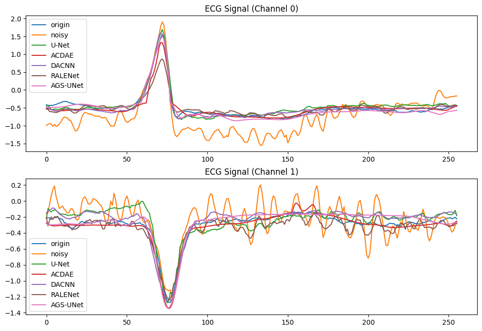

# AGS-UNet: ECG信号去噪网络

## 网络概述

AGS-UNet (Attention Gated Shrinkage UNet) 是一种专为ECG信号去噪任务设计的深度学习网络. 该网络创新性地融合了双重注意力机制与轻量化设计, 在保证高效推理速度的同时, 实现了卓越的噪声抑制性能

## 💡 核心特点

### 🔥 双重注意力协同去噪

- **特征级自适应去噪**：编码器集成的收缩模块通过可学习阈值机制, 实现特征层面的智能噪声过滤
- **空间感知增强**：跳跃连接中的注意力门控单元, 对特征映射进行空间重要性重加权

### 🎯 渐进式特征融合

- **跨尺度特征选择**：注意力门控机制智能筛选多尺度特征, 实现精准的特征传递
- **语义一致性保持**：确保编码器与解码器间的特征语义对齐, 促进信息流畅传递

### ⚡ 轻量化高效设计

- **优化卷积结构**：采用小尺度卷积核, 平衡感受野与计算效率
- **精简参数量**：在保持性能的前提下, 降低模型复杂度和计算开销

### 🚀 端到端优化

- **直接信号映射**：构建从含噪信号 (ECG双导联信号) 到纯净信号的端到端学习框架

## 📊 模型对比结果

<table>
  <thead>
    <tr>
      <th rowspan="2">Methods</th>
      <th colspan="5">SNR(dB)</th>
      <th colspan="5">RMSE</th>
    </tr>
    <tr>
      <th>-4dB</th>
      <th>-2dB</th>
      <th>0dB</th>
      <th>2dB</th>
      <th>4dB</th>
      <th>-4dB</th>
      <th>-2dB</th>
      <th>0dB</th>
      <th>2dB</th>
      <th>4dB</th>
    </tr>
  </thead>
  <tbody>
    <tr>
      <td>FFT</td>
      <td>1.5032</td>
      <td>3.4867</td>
      <td>5.4740</td>
      <td>7.4686</td>
      <td>9.4679</td>
      <td>0.4009</td>
      <td>0.3190</td>
      <td>0.2539</td>
      <td>0.2019</td>
      <td>0.1604</td>
    </tr>
    <tr>
      <td>DWT</td>
      <td>1.7186</td>
      <td>3.6650</td>
      <td>5.6204</td>
      <td>7.5788</td>
      <td>9.5565</td>
      <td>0.3920</td>
      <td>0.3131</td>
      <td>0.2499</td>
      <td>0.2015</td>
      <td>0.1587</td>
    </tr>
    <tr>
      <td>U-Net</td>
      <td>7.3515</td>
      <td>8.3131</td>
      <td>9.3004</td>
      <td>10.3593</td>
      <td>11.4875</td>
      <td>0.1996</td>
      <td>0.1781</td>
      <td>0.1582</td>
      <td>0.1398</td>
      <td>0.1226</td>
    </tr>
    <tr>
      <td>DACNN</td>
      <td>7.9918</td>
      <td>8.9504</td>
      <td>9.9222</td>
      <td>11.0102</td>
      <td><strong>12.1790</strong></td>
      <td>0.1839</td>
      <td>0.1656</td>
      <td>0.1467</td>
      <td>0.1300</td>
      <td><strong>0.1135</strong></td>
    </tr>
    <tr>
      <td>ACDAE</td>
      <td>8.6190</td>
      <td>9.4196</td>
      <td>10.0797</td>
      <td>11.0296</td>
      <td>11.7969</td>
      <td>0.1745</td>
      <td>0.1579</td>
      <td>0.1460</td>
      <td>0.1304</td>
      <td>0.1189</td>
    </tr>
    <tr>
      <td>RA-LENet</td>
      <td>6.7556</td>
      <td>7.8118</td>
      <td>9.0741</td>
      <td>10.3406</td>
      <td>11.5745</td>
      <td>0.2130</td>
      <td>0.1885</td>
      <td>0.1640</td>
      <td>0.1419</td>
      <td>0.1241</td>
    </tr>
    <tr style="background-color: #f0f8f0;">
      <td><strong>AGS-UNet (ours)</strong></td>
      <td><strong>8.8426</strong></td>
      <td><strong>9.6103</strong></td>
      <td><strong>10.4406</strong></td>
      <td><strong>11.3355</strong></td>
      <td>12.1362</td>
      <td><strong>0.1704</strong></td>
      <td><strong>0.1550</strong></td>
      <td><strong>0.1398</strong></td>
      <td><strong>0.1258</strong></td>
      <td>0.1141</td>
    </tr>
  </tbody>
</table>

---

## 🎨 去噪效果可视化

### 多方法去噪对比

*不同去噪方法在-4dB噪声级下对双通道ECG信号的去噪效果对比*

---

## 🏆 性能总结

AGS-UNet在多个噪声水平下均表现出色, 特别是在低信噪比条件下(-4dB至2dB)的SNR和RMSE指标均优于对比方法. 该网络通过双重注意力机制实现了对ECG信号中噪声的有效抑制, 同时保持了重要的生理特征信息

**by Dan Liu, Tianhai Xie @IIP-2025**